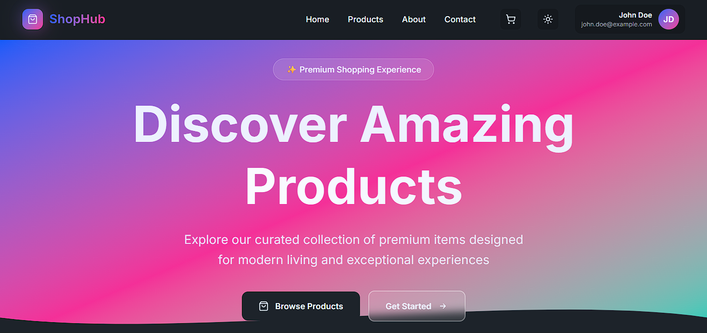
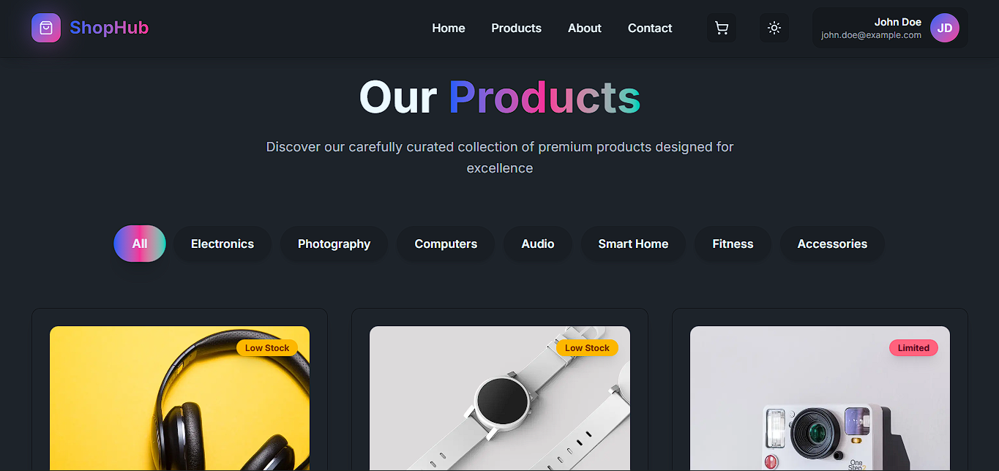
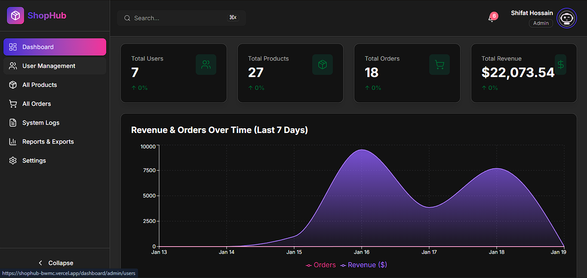

# 🛍️ ShopHub - Modern E-Commerce Platform

<div align="center">



**A full-stack, production-ready e-commerce platform with real-time notifications, role-based dashboards, and seamless payment integration.**

[](https://nextjs.org/)
[](https://reactjs.org/)
[](https://firebase.google.com/)
[](https://www.mongodb.com/)
[](https://stripe.com/)
[](https://tailwindcss.com/)

[Live Demo](https://shophub-demo.vercel.app) · [Report Bug](https://github.com/hossain-shifat/Shop-Hub/issues) · [Request Feature](https://github.com/hossain-shifat/Shop-Hub/issues)

</div>

---

## 📖 Table of Contents

- [Overview](#-overview)
- [Features](#-features)
- [Tech Stack](#-tech-stack)
- [Screenshots](#-screenshots)
- [Getting Started](#-getting-started)
- [Installation](#-installation)
- [Environment Variables](#-environment-variables)
- [Project Structure](#-project-structure)
- [API Documentation](#-api-documentation)
- [Deployment](#-deployment)
- [Contributing](#-contributing)
- [License](#-license)
- [Contact](#-contact)

---

## 🌟 Overview

**ShopHub** is a comprehensive e-commerce solution built with modern web technologies. It features a powerful admin panel, seller dashboard, rider management system, real-time notifications, secure payment processing, and a beautiful, responsive user interface. Perfect for businesses looking to establish an online presence or developers wanting to learn full-stack development.

### Why ShopHub?

- ✅ **Production-Ready** - Built with scalability and performance in mind
- ✅ **Real-time Updates** - Firebase Firestore for instant notifications
- ✅ **Secure Payments** - Stripe integration with PCI compliance
- ✅ **Role-Based Access** - Admin, Seller, Rider, and User dashboards
- ✅ **Delivery Management** - Complete rider assignment and tracking system
- ✅ **Modern UI/UX** - Beautiful gradients, animations, and responsive design
- ✅ **Auto-Scaling** - MongoDB with TTL indexing and efficient queries
- ✅ **SEO Optimized** - Server-side rendering with Next.js 16

---

## ✨ Features

### 🛒 **Customer Experience**

- **Product Catalog** - Advanced filtering, sorting, and search functionality
- **Product Details** - High-quality images, reviews, ratings, and specifications
- **Shopping Cart** - Real-time cart management with quantity updates
- **Wishlist** - Save favorite products for later
- **Secure Checkout** - Stripe payment integration with multiple payment methods
- **Order Tracking** - Real-time order status updates with delivery tracking
- **User Dashboard** - Manage profile, orders, and payment history
- **Product Reviews** - Rate and review purchased products
- **Track Orders** - Live tracking with rider information and location updates

### 🏪 **Seller Dashboard**

- **Product Management** - Add, edit, delete, and manage product listings
- **Order Management** - Track and fulfill customer orders
- **Rider Assignment** - Assign riders to orders for delivery
- **Inventory Control** - Monitor stock levels with low-stock alerts
- **Sales Analytics** - View sales performance and revenue metrics
- **Notification System** - Real-time alerts for new orders and reviews
- **Multi-Image Upload** - Support for multiple product images
- **Rich Product Editor** - Add features, specifications, and descriptions

### 🚴 **Rider Dashboard**

- **Task Management** - View and manage delivery assignments
- **Accept/Reject Deliveries** - Control over delivery acceptance
- **Status Updates** - Update delivery status (picked up, in transit, delivered)
- **Earnings Tracking** - Monitor delivery fees and total earnings
- **Performance Metrics** - Track on-time deliveries, ratings, and completion rate
- **Order History** - Complete delivery history with earnings breakdown
- **Profile Management** - Update vehicle info, availability status
- **Real-time Notifications** - Instant alerts for new delivery assignments

### 👨‍💼 **Admin Panel**

- **User Management** - View and manage all users (Admin, Seller, Rider, User roles)
- **Rider Verification** - Review and approve rider registrations
- **Rider Assignment** - Assign riders to orders based on location and availability
- **Product Approval** - Review and approve seller product submissions
- **Order Monitoring** - Oversee all platform orders and delivery statuses
- **Analytics & Reports** - Comprehensive business insights with charts
- **Data Export** - Export data in CSV/Excel format (orders, users, products, payments)
- **System Logs** - Monitor platform activities and errors
- **Settings Control** - Configure platform settings and policies

### 🔔 **Real-time Notifications**

- **Instant Updates** - Firebase Firestore for real-time notification delivery
- **Smart Auto-delete** - Notifications auto-delete 5 minutes after reading (TTL)
- **Multi-trigger Support** - Order updates, payment confirmations, account changes
- **Persistent Storage** - MongoDB with efficient indexing
- **Badge Indicators** - Unread count with animated badges
- **Notification Types**:
  - Order placed/confirmed/shipped/delivered/cancelled
  - Payment success/failed
  - Rider assignment and delivery updates
  - Account created/password changed
  - Product approved/rejected
  - New reviews and ratings
  - Low stock alerts
  - User registrations (Admin)
  - Rider earnings notifications

### 💳 **Payment System**

- **Stripe Integration** - Secure, PCI-compliant payment processing
- **Multiple Payment Methods** - Credit/debit cards and Cash on Delivery
- **Invoice Generation** - Automatic PDF invoice creation with download
- **Payment Tracking** - Complete transaction history
- **Refund Support** - Handle returns and refunds seamlessly
- **Order Success Page** - Beautiful confirmation with confetti animation

### 🎨 **Design & UX**

- **Modern UI** - Gradient designs, glassmorphism, and micro-animations
- **Responsive Design** - Mobile-first approach, works on all devices
- **Dark/Light Theme** - Theme toggle with persistent preferences
- **Smooth Animations** - Framer Motion for fluid transitions
- **Toast Notifications** - User feedback for all actions
- **Loading States** - Skeleton loaders and progress indicators
- **Error Handling** - Custom 404, 403, 500 error pages

---

## 🚀 Tech Stack

### **Frontend**

| Technology | Version | Purpose |
|------------|---------|---------|
| **Next.js** | 16.1.1 | React framework with App Router |
| **React** | 19.2.3 | UI library |
| **Tailwind CSS** | 4.1.18 | Utility-first CSS framework |
| **DaisyUI** | 5.5.14 | Component library |
| **Framer Motion** | 12.26.1 | Animation library |
| **Lucide React** | 0.562.0 | Icon library |
| **Firebase** | 12.8.0 | Authentication & Firestore |
| **Stripe.js** | 8.6.1 | Payment processing |
| **React Hot Toast** | 2.6.0 | Toast notifications |
| **Recharts** | 3.6.0 | Data visualization |
| **React Hook Form** | 7.71.1 | Form handling |
| **Zod** | 4.3.5 | Schema validation |
| **date-fns** | 4.1.0 | Date utilities |
| **jsPDF** | 4.0.0 | PDF generation |
| **html2canvas** | 1.6.4 | HTML to canvas conversion |
| **React Confetti** | 6.4.0 | Celebration animations |
| **SheetJS (xlsx)** | 0.18.5 | Excel export |

### **Backend**

| Technology | Version | Purpose |
|------------|---------|---------|
| **Node.js** | LTS | JavaScript runtime |
| **Express.js** | 4.18.2 | Web framework |
| **MongoDB** | 8.0 | NoSQL database |
| **Mongoose** | 8.0.0 | ODM for MongoDB |
| **Firebase Admin** | 13.6.0 | Server-side Firebase SDK |
| **Stripe** | 14.25.0 | Payment processing |
| **bcryptjs** | 2.4.3 | Password hashing |
| **jsonwebtoken** | 9.0.2 | JWT tokens |
| **Nodemailer** | 7.0.12 | Email service |
| **PDFKit** | 0.17.2 | PDF generation |
| **UUID** | 9.0.1 | Unique ID generation |
| **Express Validator** | 7.0.1 | Request validation |

### **DevOps & Deployment**

- **Vercel** - Frontend hosting with auto-deployment
- **Render/Railway** - Backend API hosting
- **MongoDB Atlas** - Cloud database
- **Firebase Hosting** - Authentication & Firestore
- **Stripe Dashboard** - Payment monitoring

---

## 📸 Screenshots

<div align="center">

### Landing Page


### Product Catalog


### Smart Dashboard


### Checkout Flow
*Seamless payment experience with Stripe*

</div>

---

## 🎯 Getting Started

### Prerequisites

Before you begin, ensure you have the following installed:

- **Node.js** (v18 or higher) - [Download](https://nodejs.org/)
- **npm** or **yarn** - Comes with Node.js
- **MongoDB** - [MongoDB Atlas](https://www.mongodb.com/cloud/atlas) (recommended)
- **Git** - [Download](https://git-scm.com/)

### Required Accounts

You'll need accounts for:

1. **Firebase** - [Console](https://console.firebase.google.com/)
2. **MongoDB Atlas** - [Sign Up](https://www.mongodb.com/cloud/atlas/register)
3. **Stripe** - [Dashboard](https://dashboard.stripe.com/)

---

## 📦 Installation

### 1. Clone the Repository

```bash
git clone https://github.com/hossain-shifat/Shop-Hub.git
cd Shop-Hub
```

### 2. Install Frontend Dependencies

```bash
npm install
```

### 3. Install Backend Dependencies

```bash
cd backend
npm install
cd ..
```

### 4. Set Up Environment Variables

#### Frontend Environment Variables

Create `.env.local` in the root directory:

```env
# Backend API
NEXT_PUBLIC_API_URL=http://localhost:5000/api

# Firebase Configuration
NEXT_PUBLIC_FIREBASE_API_KEY=your_firebase_api_key
NEXT_PUBLIC_FIREBASE_AUTH_DOMAIN=your_project.firebaseapp.com
NEXT_PUBLIC_FIREBASE_PROJECT_ID=your_project_id
NEXT_PUBLIC_FIREBASE_STORAGE_BUCKET=your_project.appspot.com
NEXT_PUBLIC_FIREBASE_MESSAGING_SENDER_ID=your_sender_id
NEXT_PUBLIC_FIREBASE_APP_ID=your_app_id

# Stripe (Optional for frontend)
NEXT_PUBLIC_STRIPE_PUBLISHABLE_KEY=your_stripe_publishable_key

# ImgBB API (for image uploads)
NEXT_PUBLIC_IMGBB_API_KEY=your_imgbb_api_key
```

#### Backend Environment Variables

Create `.env` in the `backend` directory:

```env
# Server
PORT=5000
NODE_ENV=development

# MongoDB
MONGODB_URI=your_mongodb_connection_string

# Firebase Admin SDK
FIREBASE_PROJECT_ID=your_firebase_project_id
FIREBASE_CLIENT_EMAIL=your_firebase_client_email
FIREBASE_PRIVATE_KEY="your_firebase_private_key"

# Stripe
STRIPE_SECRET_KEY=your_stripe_secret_key
STRIPE_WEBHOOK_SECRET=your_stripe_webhook_secret

# JWT
JWT_SECRET=your_jwt_secret_key

# Email (Optional)
EMAIL_HOST=smtp.gmail.com
EMAIL_PORT=587
EMAIL_USER=your_email@gmail.com
EMAIL_PASSWORD=your_app_password

# Frontend URL (for CORS and redirects)
FRONTEND_URL=http://localhost:3000
```

### 5. Firebase Setup

1. **Create Firebase Project**
   - Go to [Firebase Console](https://console.firebase.google.com/)
   - Click "Add Project"
   - Follow the setup wizard

2. **Enable Authentication**
   - Go to Build → Authentication
   - Enable Email/Password and Google providers

3. **Enable Firestore**
   - Go to Build → Firestore Database
   - Create database in production mode
   - Add security rules (see [Firestore Rules](#firestore-security-rules))

4. **Get Service Account**
   - Project Settings → Service Accounts
   - Generate new private key
   - Save the JSON file
   - Extract credentials for backend `.env`

### 6. MongoDB Setup

1. **Create MongoDB Atlas Cluster**
   - Sign up at [MongoDB Atlas](https://www.mongodb.com/cloud/atlas)
   - Create a free cluster
   - Create database user
   - Whitelist your IP (or allow from anywhere for development)
   - Get connection string

2. **Configure Connection String**
   - Replace `<password>` with your database user password
   - Replace `<dbname>` with your database name
   - Add to backend `.env` as `MONGODB_URI`

### 7. Stripe Setup

1. **Create Stripe Account**
   - Sign up at [Stripe](https://dashboard.stripe.com/)
   - Complete account setup

2. **Get API Keys**
   - Go to Developers → API keys
   - Copy Publishable key (for frontend)
   - Copy Secret key (for backend)
   - Add to respective `.env` files

3. **Configure Webhooks** (Optional for production)
   - Go to Developers → Webhooks
   - Add endpoint: `your-backend-url/api/payments/webhook`
   - Select events: `checkout.session.completed`, `payment_intent.succeeded`
   - Copy webhook secret to backend `.env`

### 8. Run the Application

#### Start Backend Server

```bash
cd backend
npm run dev
```

Backend will run on [http://localhost:5000](http://localhost:5000)

#### Start Frontend Development Server

Open a new terminal:

```bash
npm run dev
```

Frontend will run on [http://localhost:3000](http://localhost:3000)

### 9. Access the Application

- **Frontend**: [http://localhost:3000](http://localhost:3000)
- **Backend API**: [http://localhost:5000/api](http://localhost:5000/api)

### 10. Create Admin Account

1. Register a new account through the UI
2. In MongoDB Atlas, find the user document
3. Update the `role` field to `"admin"`
4. Refresh the page and access admin dashboard

---

## 🔐 Environment Variables

### Frontend (.env.local)

| Variable | Description | Required |
|----------|-------------|----------|
| `NEXT_PUBLIC_API_URL` | Backend API URL | ✅ |
| `NEXT_PUBLIC_FIREBASE_API_KEY` | Firebase API key | ✅ |
| `NEXT_PUBLIC_FIREBASE_AUTH_DOMAIN` | Firebase auth domain | ✅ |
| `NEXT_PUBLIC_FIREBASE_PROJECT_ID` | Firebase project ID | ✅ |
| `NEXT_PUBLIC_FIREBASE_STORAGE_BUCKET` | Firebase storage bucket | ✅ |
| `NEXT_PUBLIC_FIREBASE_MESSAGING_SENDER_ID` | Firebase sender ID | ✅ |
| `NEXT_PUBLIC_FIREBASE_APP_ID` | Firebase app ID | ✅ |
| `NEXT_PUBLIC_STRIPE_PUBLISHABLE_KEY` | Stripe publishable key | ⚠️ |
| `NEXT_PUBLIC_IMGBB_API_KEY` | ImgBB API key for image uploads | ✅ |

### Backend (.env)

| Variable | Description | Required |
|----------|-------------|----------|
| `PORT` | Server port | ✅ |
| `MONGODB_URI` | MongoDB connection string | ✅ |
| `FIREBASE_PROJECT_ID` | Firebase project ID | ✅ |
| `FIREBASE_CLIENT_EMAIL` | Firebase client email | ✅ |
| `FIREBASE_PRIVATE_KEY` | Firebase private key | ✅ |
| `STRIPE_SECRET_KEY` | Stripe secret key | ✅ |
| `STRIPE_WEBHOOK_SECRET` | Stripe webhook secret | ⚠️ |
| `JWT_SECRET` | JWT secret for tokens | ✅ |
| `FRONTEND_URL` | Frontend URL for CORS | ✅ |
| `EMAIL_HOST` | SMTP host | ❌ |
| `EMAIL_PORT` | SMTP port | ❌ |
| `EMAIL_USER` | Email address | ❌ |
| `EMAIL_PASSWORD` | Email password | ❌ |

**Legend**: ✅ Required | ⚠️ Required for payments | ❌ Optional

---

## 📁 Project Structure

```
ShopHub/
├── 📁 app/                          # Next.js App Router
│   ├── 📁 (auth)/                   # Authentication routes
│   │   ├── forgot-password/         # Password reset page
│   │   ├── login/                   # Login page
│   │   ├── register/                # Registration page
│   │   └── layout.jsx               # Auth layout wrapper
│   ├── 📁 (main)/                   # Main application routes
│   │   ├── about/                   # About page
│   │   ├── cart/                    # Shopping cart
│   │   ├── checkout/                # Checkout process
│   │   ├── contact/                 # Contact page
│   │   ├── cookies/                 # Cookie policy
│   │   ├── help/                    # Help center
│   │   ├── notifications/           # Notifications page
│   │   ├── order-success/           # Order confirmation
│   │   ├── orders/                  # Order history & details
│   │   │   └── [id]/                # Single order details
│   │   ├── payment-cancel/          # Payment cancelled
│   │   ├── payment-error/           # Payment error
│   │   ├── payment-success/         # Payment success
│   │   ├── privacy/                 # Privacy policy
│   │   ├── products/                # Product catalog & details
│   │   │   └── [id]/                # Product details page
│   │   ├── profile/                 # User profile
│   │   ├── returns/                 # Returns policy
│   │   ├── settings/                # User settings
│   │   ├── shipping/                # Shipping info
│   │   ├── terms/                   # Terms of service
│   │   ├── track/                   # Order tracking
│   │   ├── wishlist/                # Saved products
│   │   ├── layout.jsx               # Main layout
│   │   └── page.jsx                 # Landing page
│   ├── 📁 add-product/              # Quick add product (legacy)
│   │   └── page.jsx
│   ├── 📁 api/                      # API routes
│   │   ├── auth/
│   │   │   └── session/             # Session management
│   │   ├── notifications/           # Notification APIs
│   │   │   ├── [id]/
│   │   │   │   ├── read/            # Mark as read
│   │   │   │   └── route.js         # Delete notification
│   │   │   ├── user/
│   │   │   │   └── [userId]/
│   │   │   │       └── read-all/    # Mark all as read
│   │   │   └── route.js             # Get notifications
│   │   └── products/                # Product APIs
│   │       ├── [id]/                # Single product
│   │       └── route.js             # All products
│   ├── 📁 dashboard/                # Role-based dashboards
│   │   ├── 📁 admin/                # Admin panel
│   │   │   ├── assign-rider/        # Assign riders to orders
│   │   │   ├── logs/                # System logs
│   │   │   ├── orders/              # Order management
│   │   │   ├── products/            # Product management
│   │   │   ├── reports/             # Analytics & reports
│   │   │   ├── settings/            # Admin settings
│   │   │   ├── users/               # User management
│   │   │   └── page.jsx             # Admin dashboard home
│   │   ├── 📁 components/           # Dashboard components
│   │   │   ├── charts/              # Chart components
│   │   │   │   ├── AreaChart.jsx
│   │   │   │   ├── Index.jsx
│   │   │   │   ├── LineChart.jsx
│   │   │   │   ├── PieChart.jsx
│   │   │   │   └── StatsCard.jsx
│   │   │   ├── DashboardNavbar.jsx  # Dashboard navigation
│   │   │   └── DataTable.jsx        # Reusable table component
│   │   ├── 📁 rider/                # Rider dashboard
│   │   │   ├── income/              # Earnings tracking
│   │   │   ├── my-tasks/            # Delivery assignments
│   │   │   ├── settings/            # Rider settings
│   │   │   └── page.jsx             # Rider dashboard home
│   │   ├── 📁 seller/               # Seller dashboard
│   │   │   ├── add-product/         # Add new product
│   │   │   ├── assign-rider/        # Assign riders
│   │   │   ├── orders/              # Seller orders
│   │   │   ├── products/            # Product management
│   │   │   ├── settings/            # Seller settings
│   │   │   └── page.jsx             # Seller dashboard home
│   │   ├── 📁 user/                 # User dashboard
│   │   │   ├── orders/              # User orders
│   │   │   ├── payments/            # Payment history
│   │   │   ├── settings/            # User settings
│   │   │   └── page.jsx             # User dashboard home
│   │   ├── layout.jsx               # Dashboard layout
│   │   └── loading.jsx              # Dashboard loading state
│   ├── 📁 rider-info/               # Rider registration
│   │   └── page.jsx
│   ├── 404.html                     # Static 404 page
│   ├── error.jsx                    # Error boundary
│   ├── globals.css                  # Global styles
│   ├── icon.png                     # App icon
│   ├── index.html                   # Static index
│   ├── layout.jsx                   # Root layout
│   ├── loading.jsx                  # Loading state
│   └── not-found.jsx                # 404 page
├── 📁 assets/                       # Static assets
│   ├── dashboard.png
│   ├── hero.png
│   └── products.png
├── 📁 backend/                      # Express.js Backend
│   ├── 📁 src/
│   │   ├── 📁 config/               # Configuration files
│   │   ├── 📁 controllers/          # Route controllers
│   │   ├── 📁 middleware/           # Express middleware
│   │   ├── 📁 models/               # Mongoose models
│   │   │   ├── Notification.js      # Notification schema
│   │   │   ├── Order.js             # Order schema with tracking
│   │   │   ├── Payment.js           # Payment schema
│   │   │   ├── Product.js           # Product schema
│   │   │   ├── Rider.js             # Rider schema
│   │   │   ├── Settings.js          # Settings schema
│   │   │   └── User.js              # User schema
│   │   ├── 📁 routes/               # API routes
│   │   │   ├── auth.js              # Authentication routes
│   │   │   ├── notifications.js     # Notification routes
│   │   │   ├── orders.js            # Order routes
│   │   │   ├── payments.js          # Payment routes
│   │   │   ├── products.js          # Product routes
│   │   │   ├── riders.js            # Rider routes
│   │   │   └── settings.js          # Settings routes
│   │   ├── 📁 utils/                # Utilities
│   │   │   ├── email.js             # Email service
│   │   │   ├── invoice.js           # Invoice generation
│   │   │   └── notificationService.js # Notification service
│   │   └── server.js                # Express app
│   ├── .gitignore
│   ├── package-lock.json
│   ├── package.json
│   └── vercel.json                  # Vercel deployment config
├── 📁 components/                   # React components
│   ├── 📁 error-pages/              # Error page components
│   │   ├── Error403.jsx
│   │   └── Error500.jsx
│   ├── AuthenticatedHome.jsx        # Home for logged-in users
│   ├── DefaultHomePage.jsx          # Default landing page
│   ├── Footer.jsx                   # Site footer
│   ├── Invoice.jsx                  # Invoice component
│   ├── Logo.jsx                     # Logo component
│   ├── Navbar.jsx                   # Navigation bar
│   ├── NotificationDropdown.jsx     # Notification dropdown
│   ├── ProtectedRoute.jsx           # Route protection
│   ├── Themetoggle.jsx              # Theme switcher
│   └── TrackingWidget.jsx           # Order tracking widget
├── 📁 contexts/                     # React Context
│   └── CartContext.jsx              # Shopping cart state
├── 📁 lib/                          # Libraries & utilities
│   ├── 📁 firebase/                 # Firebase configuration
│   │   ├── auth.js                  # Auth helpers
│   │   └── config.js                # Firebase config
│   ├── 📁 hooks/                    # Custom React hooks
│   │   ├── useFirebaseAuth.js       # Auth hook
│   │   ├── useNotifications.js      # Notifications hook
│   │   └── useTheme.js              # Theme hook
│   ├── 📁 mongodb/                  # MongoDB utilities
│   │   └── mongodb.js               # MongoDB client
│   └── 📁 stripe/                   # Stripe configuration
│       └── config.js                # Stripe config
├── 📁 public/                       # Static assets
│   ├── file.svg
│   ├── globe.svg
│   ├── icon.png
│   ├── next.svg
│   ├── vercel.svg
│   └── window.svg
├── 📁 utils/                        # Utility functions
│   ├── bdLocations.js               # Bangladesh location data
│   └── imageUpload.js               # Image upload utilities
├── .gitignore
├── README.md                        # This file
├── eslint.config.mjs                # ESLint configuration
├── jsconfig.json                    # JavaScript config
├── middleware.js                    # Next.js middleware
├── next.config.mjs                  # Next.js configuration
├── package-lock.json
├── package.json                     # Dependencies
├── postcss.config.mjs               # PostCSS config
└── tailwind.config.js               # Tailwind configuration
```

---

## 📡 API Documentation

### Authentication Endpoints

| Method | Endpoint | Description | Auth Required |
|--------|----------|-------------|---------------|
| `POST` | `/api/auth/register` | Register new user | ❌ |
| `POST` | `/api/auth/login` | Login user | ❌ |
| `GET` | `/api/auth/user/:uid` | Get user by UID | ❌ |
| `PATCH` | `/api/auth/users/:uid` | Update user | ✅ |
| `GET` | `/api/auth/users` | Get all users (Admin) | ✅ |

### Product Endpoints

| Method | Endpoint | Description | Auth Required |
|--------|----------|-------------|---------------|
| `GET` | `/api/products` | Get all products | ❌ |
| `GET` | `/api/products/:id` | Get single product | ❌ |
| `POST` | `/api/products` | Create product | ✅ |
| `PATCH` | `/api/products/:id` | Update product | ✅ |
| `DELETE` | `/api/products/:id` | Delete product | ✅ |
| `POST` | `/api/products/:id/reviews` | Add review | ✅ |

### Order Endpoints

| Method | Endpoint | Description | Auth Required |
|--------|----------|-------------|---------------|
| `POST` | `/api/orders` | Create order | ✅ |
| `GET` | `/api/orders/user/:userId` | Get user orders | ✅ |
| `GET` | `/api/orders/:orderId` | Get single order | ✅ |
| `PATCH` | `/api/orders/:orderId/status` | Update order status | ✅ |
| `GET` | `/api/orders/tracking/:trackingId` | Track order | ❌ |

### Payment Endpoints

| Method | Endpoint | Description | Auth Required |
|--------|----------|-------------|---------------|
| `POST` | `/api/payments/create-checkout-session` | Create Stripe session | ✅ |
| `POST` | `/api/payments/verify-session` | Verify payment | ✅ |
| `GET` | `/api/payments/order/:orderId` | Get payment details | ✅ |
| `GET` | `/api/payments` | Get all payments (Admin) | ✅ |

### Notification Endpoints

| Method | Endpoint | Description | Auth Required |
|--------|----------|-------------|---------------|
| `GET` | `/api/notifications/user/:userId` | Get user notifications | ✅ |
| `GET` | `/api/notifications/user/:userId/unread-count` | Get unread count | ✅ |
| `POST` | `/api/notifications` | Create notification | ✅ |
| `PATCH` | `/api/notifications/:id/read` | Mark as read | ✅ |
| `PATCH` | `/api/notifications/user/:userId/read-all` | Mark all as read | ✅ |
| `DELETE` | `/api/notifications/:id` | Delete notification | ✅ |

### Rider Endpoints

| Method | Endpoint | Description | Auth Required |
|--------|----------|-------------|---------------|
| `POST` | `/api/riders/register` | Register as rider | ✅ |
| `GET` | `/api/riders` | Get all riders (Admin) | ✅ |
| `GET` | `/api/riders/available` | Get available riders | ✅ |
| `GET` | `/api/riders/unverified` | Get unverified riders | ✅ |
| `GET` | `/api/riders/:uid` | Get rider details | ✅ |
| `PATCH` | `/api/riders/:uid/verify` | Verify rider (Admin) | ✅ |
| `POST` | `/api/riders/verify-all` | Verify all riders | ✅ |
| `POST` | `/api/riders/assign` | Assign rider to order | ✅ |
| `POST` | `/api/riders/accept-delivery` | Accept delivery | ✅ |
| `POST` | `/api/riders/reject-delivery` | Reject delivery | ✅ |
| `PATCH` | `/api/riders/update-status` | Update delivery status | ✅ |
| `GET` | `/api/riders/:riderId/orders` | Get rider orders | ✅ |
| `GET` | `/api/riders/:riderId/earnings` | Get rider earnings | ✅ |

---

## 🚢 Deployment

### Deploy Frontend to Vercel

1. **Install Vercel CLI**
   ```bash
   npm install -g vercel
   ```

2. **Login to Vercel**
   ```bash
   vercel login
   ```

3. **Deploy**
   ```bash
   vercel
   ```

4. **Add Environment Variables**
   - Go to Vercel Dashboard
   - Settings → Environment Variables
   - Add all `NEXT_PUBLIC_*` variables
   - Redeploy

5. **Production Deployment**
   ```bash
   vercel --prod
   ```

### Deploy Backend to Render

1. **Create account** at [Render.com](https://render.com)

2. **Create New Web Service**
   - Connect GitHub repository
   - Select backend directory

3. **Configure**
   - **Build Command**: `cd backend && npm install`
   - **Start Command**: `cd backend && npm start`
   - **Environment**: Node

4. **Add Environment Variables**
   - Add all backend `.env` variables

5. **Deploy**
   - Click "Create Web Service"

### Alternative: Deploy to Railway

```bash
# Install Railway CLI
npm install -g @railway/cli

# Login
railway login

# Initialize
cd backend
railway init

# Deploy
railway up

# Add environment variables via dashboard
```

### Post-Deployment Checklist

- [ ] Update `NEXT_PUBLIC_API_URL` to production backend URL
- [ ] Update `FRONTEND_URL` in backend to production frontend URL
- [ ] Configure Stripe webhook with production URL
- [ ] Enable Firestore in production mode
- [ ] Set up MongoDB Atlas IP whitelist
- [ ] Test all authentication flows
- [ ] Test payment processing
- [ ] Test rider assignment and delivery tracking
- [ ] Test notifications
- [ ] Verify error pages work
- [ ] Check mobile responsiveness
- [ ] Run Lighthouse audit

---

## 🧪 Testing

### Frontend Testing

```bash
# Run in development mode
npm run dev

# Build for production
npm run build

# Start production server
npm start

# Lint code
npm run lint
```

### Backend Testing

```bash
cd backend

# Run in development mode
npm run dev

# Start production server
npm start
```

### Test User Credentials

Create test accounts with these roles:

**Admin**
```
Email: admin@shophub.com
Password: admin123
Role: admin
```

**Seller**
```
Email: seller@shophub.com
Password: seller123
Role: seller
```

**Rider**
```
Email: rider@shophub.com
Password: rider123
Role: rider
```

**User**
```
Email: user@shophub.com
Password: user123
Role: user
```

---

## 🎨 Firestore Security Rules

```javascript
rules_version = '2';
service cloud.firestore {
  match /databases/{database}/documents {
    // Notifications
    match /notifications/{notificationId} {
      allow read: if request.auth != null &&
                     resource.data.userId == request.auth.uid;
      allow write: if false; // Only backend can write
    }

    // Admin access
    match /{document=**} {
      allow read, write: if request.auth != null &&
                           request.auth.token.admin == true;
    }
  }
}
```

---

## 🤝 Contributing

Contributions are what make the open-source community amazing! Any contributions you make are **greatly appreciated**.

1. Fork the Project
2. Create your Feature Branch (`git checkout -b feature/AmazingFeature`)
3. Commit your Changes (`git commit -m 'Add some AmazingFeature'`)
4. Push to the Branch (`git push origin feature/AmazingFeature`)
5. Open a Pull Request

---

## 📜 License

Distributed under the MIT License. See `LICENSE` for more information.

---

## 👨‍💻 Author

**Hossain Shifat**

- GitHub: [@hossain-shifat](https://github.com/hossain-shifat)
- LinkedIn: [Hossain Shifat](https://linkedin.com/in/hossain-shifat)
- Email: hossainshifat111@gmail.com
- Portfolio: [hossainshifat.dev](https://hossainshifat.dev)

---

## 💡 Acknowledgments

- [Next.js Documentation](https://nextjs.org/docs)
- [Firebase Documentation](https://firebase.google.com/docs)
- [MongoDB Documentation](https://docs.mongodb.com/)
- [Stripe Documentation](https://stripe.com/docs)
- [Tailwind CSS](https://tailwindcss.com/)
- [DaisyUI](https://daisyui.com/)
- [Lucide Icons](https://lucide.dev/)
- [Framer Motion](https://www.framer.com/motion/)
- [Vercel](https://vercel.com/)

---

## 📞 Support
For support and questions:

- 📧 Email: support@shophub.com
- 💬 Discord: [Join our community](https://discord.gg/shophub)
- 🐛 Issues: [GitHub Issues](https://github.com/hossain-shifat/Shop-Hub/issues)
- 📖 Docs: [Documentation](https://docs.shophub.com)

---

## ⭐ Show Your Support

If you found this project helpful, please give it a ⭐️!

<div align="center">

**Made with ❤️ by Hossain Shifat**

[⬆ Back to Top](#-shophub---modern-e-commerce-platform)

</div>
